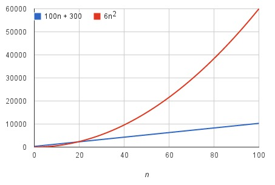

# Big-O notation

- 알고리즘 성능 비교 시 데이터 수의 증가에 따른 연산횟수의 증가율(rate of growth) 상한(upper bound)을 나타내는 표기법.
- 점근적 표기법(Asymptotic notation) 중 하나이므로 입력값 n이 아주 큰 값이라고 가정한다. 따라서 데이터 수 n에 대한 시간복잡도 함수 T(n)이 다항식으로 표현될 때, 중요도가 낮은 항과 상수를 제거한다.
  - T(n)=7*n^3+3*n^2+2 일 때, T(n) = O(n^3)
  - T(n)=2^n+n^2 일 때, T(n) = O(2^n)
  - T(n)=2^n+n^4 일 때, T(n) = O(2^n)
  - 어떤 알고리즘의 실행시간이 6n^2 + 100n + 300 이라고 가정하자. n이 증가하는 경우 6n^2의 값이 증가하는 속도가 100n+300이 증가하는 속도 보다 훨씬 빠르다. 따라서 n이 매우 커지게 되면 100n+300이 결과값에서 차지하는 비중은 매우 작아져서 추세 비교에 있어서는 무시해도 될 수준이 된다. 따라서 주어진 알고리즘의 실행시간 증가율을 점근적으로 표기법하면 n^2이 된다.
- 수학적 정의: 두 개의 함수 f(n)과 g(n)이 주어졌을 때, 모든 n>=K에 대하여 f(n)<=C(n)을 만족하는 두 개의 상수 C와 K가 존재하면, f(n)의 Big-O는 O(g(n))이다.(단, n>=0, f(n)>=0, g(n)>=0)

## 종류

- O(1): 상수형 Big-O. 데이터 수에 관계없이 연산횟수가 고정된다.
- O(logn): 데이터 수의 증가율에 비해서 연산횟수의 증가율이 훨씬 낮은 알고리즘.
- O(n): 데이터 수와 연산횟수가 비례하는 알고리즘.
- O(nlogn): 선형로그형 Big-O. 데이터의 수가 두 배로 증가할 때, 연산횟수는 두 배를 조금 넘게 증가하는 알고리즘.
- O(n^2),O(n^3): 데이터 수의 제곱에 해당하는 연산횟수를 요구하는 알고리즘.
- O(2^n): 지수형 Big-O. 현실적으로 사용에 무리가 있는 알고리즘.
- O(n!): 팩토리얼형 Big-O. 현실적으로 사용에 무리가 있는 알고리즘.

## 대소 비교

- O(1) < O(logn) < O(n) < O(nlogn) < O(n^2) < O(n^3) < O(2^n) < O(n!)

## Note

- 알고리즘 성능 판단을 위해 평균적인 경우(average case)를 비교하는 일 역시 의미가 있으나 무엇이 '평균적인가'를 정의하고 신뢰도 있는 결과값을 얻기 위해서는 다양한 자료가 필요하다. 따라서 일반적인 알고리즘 평가에는 논란의 소지가 거의 없는 최악의 경우(worst case)를 이용한다.

### References

- 윤성우, <윤성우의 열혈 자료구조>
- [Khan Academy][ka]

[ka]: <https://ko.khanacademy.org/computing/computer-science/algorithms/asymptotic-notation/a/big-o-notation> "Khan Academy"
