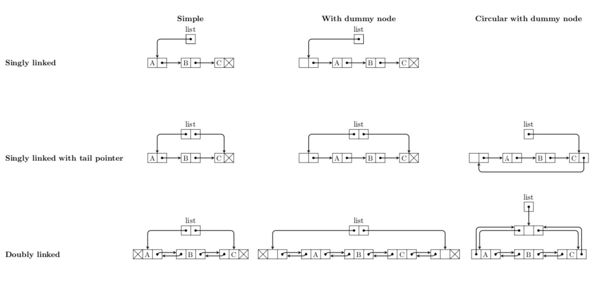

# Linked list

> "Linked list is a linear data structure, in which elements are not stored at a contiguous location, rather they are linked using pointers. Linked list forms a series of connected nodes, where each node stores the data and the address of the next node."[^linked_list_definition_0]
> 
> "In computer science, a linked list is a linear collection of data elements whose order is not given by their physical placement in memory. Instead, each element points to the next. It is a data structure consisting of a collection of nodes which together represent a sequence."[^linked_list_definition_1]

| Operation | Time complexity(worst case) |
| :-------: | :-------------------------: |
| Access    | O(n)                        |
| Traverse  | O(n)                        |
| Insert    | O(n)[^searching_time]       |
| Delete    | O(n)[^searching_time]       |

## Pros
  
- The size of memory can be allocated or de-allocated at run time based on the operation insertion or deletion so that avoids the waste of memory. Therefore linked list is useful when the size of the list is not known in advance.
- The insertion and deletion of elements are simpler than arrays since no elements need to be shifted after insertion and deletion, Just the address needed to be updated.[^linked_list_pros_0]
- Various advanced data structures can be implemented using a linked list like a stack, queue, graph, hash maps, etc.

## Cons

- Unlike array, linked list do not allow direct access to elements by index. Traversal is required to reach a specific node.
- Linked list requires additional memory for storing the pointers compared to array.
- Linked list doesn't take advantage of cache locality compared to array.

## Implementations

- [Singly linked list][sinlgy_linked_list_link]
- [Doubly linked list][doubly_linked_list_link]
- [Circular linked list][circular_linked_list_link]

### References

- 윤성우, <윤성우의 열혈 자료구조>
- 홍정모 연구소, <자료구조 압축코스>
- [GeeksforGeeks][reference_link_0]
- [Wikipedia][reference_link_1]

[sinlgy_linked_list_link]: <./SinglyLinkedList>
[doubly_linked_list_link]: <./DoublyLinkedList>
[circular_linked_list_link]: <./CircularLinkedList>
[reference_link_0]: https://www.geeksforgeeks.org/what-is-linked-list/
[reference_link_1]: https://en.wikipedia.org/wiki/Linked_list#cite_note-4

[^linked_list_definition_0]: <https://www.geeksforgeeks.org/what-is-linked-list/>
[^linked_list_definition_1]: <https://en.wikipedia.org/wiki/Linked_list#cite_note-4>
[^searching_time]: It takes time to search the specific position to insert or delete. But it takes O(1) when insertion/deletion occurs at both ends(head or tail) of the list or at the current position. In that case, linked list can be useful when insertion/deletion occurs frequently in spite of it needs additional memory for pointer to next node.
[^linked_list_pros_0]: The principal benefit of a linked list over a conventional array is that the list elements can be easily inserted or removed without reallocation or reorganization of the entire structure because the data items do not need to be stored contiguously in memory or on disk, while restructuring an array at run-time is a much more expensive operation.
